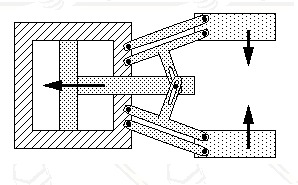
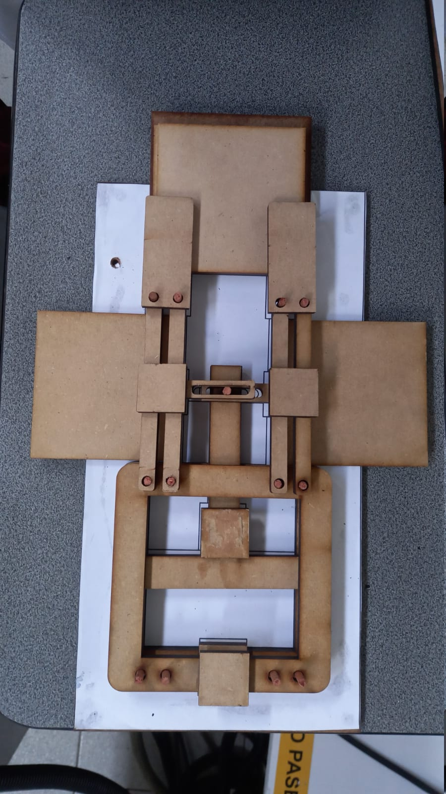
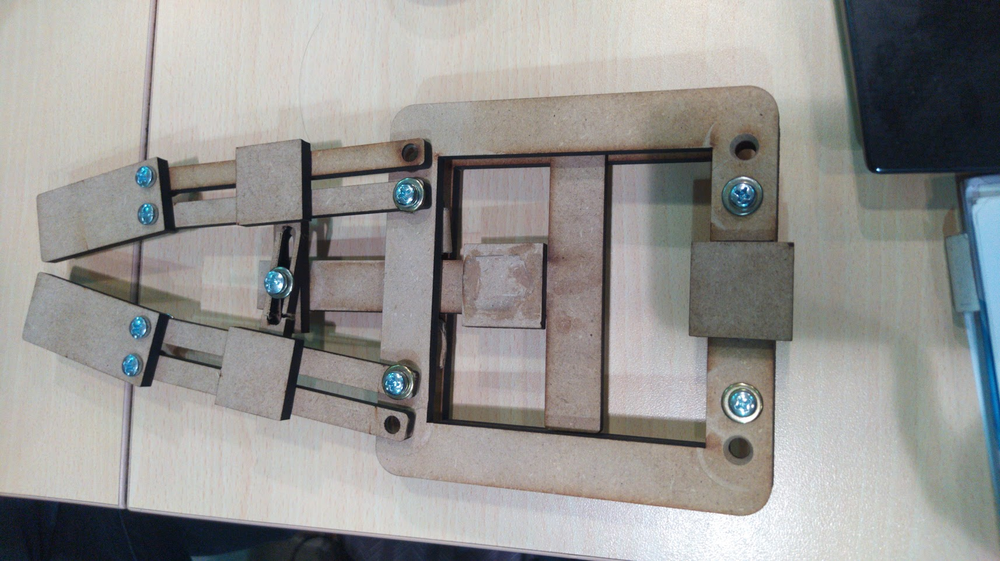
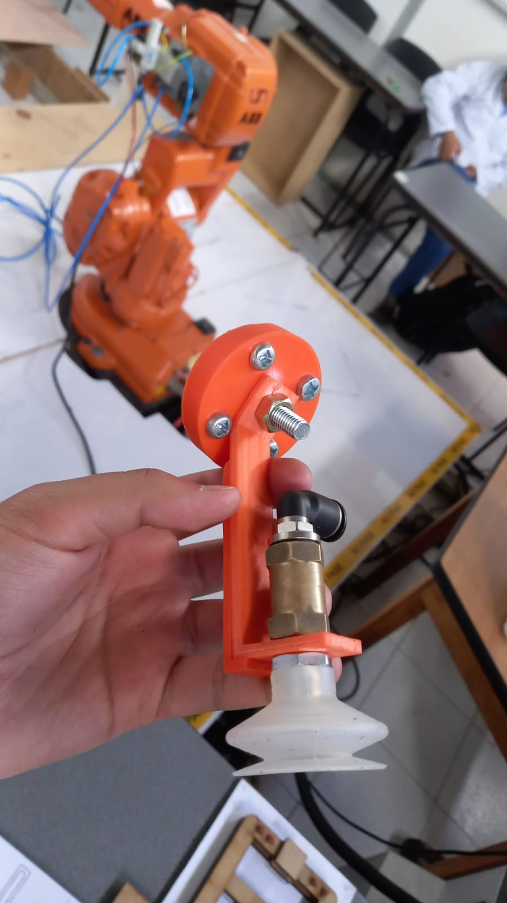

# Robótica - Proyecto Final

### Por: Sebastian Campiño Figueroa, Julián Felipe Luna Castro y Diego Fernando Mejía Hernández

Este repositorio contiene las memorias, programas, planos y la video presentación desarrollados como entregable del proyecto final de la materia robotica, donde se diseño una herramienta tipo gripper de multiples piezas que pueda ser ensamblada sobre los pines de una base plana, de forma que se desarrolle una rutina para el robot IRB140 que por medio de un actuador neumatico, diseñado tambien por nosotros, pueda tomar las piezas del gripper y ensamblarlo.

## Requerimientos
* Robot Studio versión 5 o superior
* Hoja de datos del manipulador industrial IRB 140
* Software CAD (OnShape y AutoDesk Inventor)
* Manipuladores industriales ABB IRB 140
* Controlador ABB IRC5
* Herramienta tipo gripper a ser ensamblada
* Herramienta neumatica para pick and place
* Base plana para ensamblado de la herramienta tipo gripper (con pines y guias)

## Descripción de la solución creada.
Para la solución del problema planteado debimos diseñar un gripper que se pudiera ensamblar por partes, para ello se diseñaron un total de 9 piezas que conformaron el gripper de tal manera que se pudiera poner una sobre otra y aun así fuera funcional. Para ensamblarlo se utilizó un manipulador robótico ABB IRB 140 que con ayuda de una herramienta entorno a una ventosa y la línea neumática del robot fuera capaz de sujetar las piezas desde una posición de descanso hasta una de ensamble que con ayuda de unos pasadores puestos sobre la superficie se pudiera ensamblar el gripper.  

El proceso de ensamble más específicamente consistió en agarra las piezas con ayuda de un Venturi para generar vacío y que la ventosa en la herramienta pudiera sujetar las piezas en un orden ya estipulado e ir llevando las a su posición de ensamble pasando atreves de los pasadores. 
## Gripper
Como se puede ver en las imagenes, el gripper tiene un mecanismo de funcionamiento sencillo, donde al halar una pieza en forma de T, el pin central hara que las pinzas se cierren para poder sujetar algo entre las puntas. Los planos de esta herramienta pueden encontrarse en el pdf *PlanosProyecto.pdf* dentro del directorio *Planos*. 

    
    
    

## Herramienta
Para sujetar las piezas se diseño una herramienta que estuviera a 45° con respecto al eje del plato porta herramientas para evitar singularidades y con una ventosa en su punta. También se pensó en diseñarla de la forma mas sencilla posible para que su montura fuera fácil de hacer. Como observación adicional, el diseño quedo un poco endeble por ello se debieron hacer unos refuerzos. Los planos de esta tambien pueden encontrarse en el pdf *PlanosProyecto.pdf* dentro del directorio *Planos*.

    

## Robot Studio
Para hacer la programación y creación de las trayectorias del IRB 140 se utilizó el programa RobotStudio que nos permite crear todos los puntos y trayectorias desde un ambiente simulado.
Para crear las trayectorias y los “targets” se importo los modelos creados de la distribución de las piezas en la superficie de descanso y como debía quedar el gripper ensamblado junto a la herramienta con la ventosa incluida.
Como debíamos interactuar con salidas y entradas digitales para poder manipular la electroválvula 2-5 que suministraba aire al Venturi y ventosa se simularon con ayuda del modulo I/O del robot studio para poder observar que si se estuvieran manejando de la forma correcta.
## RAPID
En el código de rapid, que se puede encontrar en la carpeta RAPID dentro de la carpeta del proyecto llamada *Prouwu*, se puede ver como se llaman todas las trayectorias utilizadas nombradas por medio de las piezas que se van a mover en cada momento adicionando las trayectorias llamadas HOME que llevan el robot a una configuración de [0 0 0 0 0 10] para iniciar cada programa en ella, normalmente se dejarían todas las articulaciones en 0 pero por problemas de singularidad se decisión dejar la sexta articulación en 10, una trayectoria de acercamiento que como su nombre lo dice lleva el robot a una posición de acercamiento para iniciar el trayecto de las piezas. 

Para el manejo de la electroválvula se utilizó una salida digital llamada DO_01 que al activarse hacían que la ventosa hiciera succión y una DO_02 que la desactivaba. Como forma de prevención se le puso un WaitTime antes de cada activación de la válvula para evitar que llegara a activar o desactivar la succión sin estar en la posición deseada, también se activaba cada una de las salidas por solo 0.5 segundos para no mantener siempre energizada esa bobina de la válvula. Como una forma preventiva y para hacer arreglos durante el montaje y posicionamiento de las piezas se puso un WaitDI para que se necesite presionar un botón identificado con la entrada DI_01 que funciona como verificación que el montaje y posición están bien, este mismo botón se utiliza para iniciar todo el proceso desde que está en HOME. Para finalizar se utilizo una tercera señal digital identificada como DO_03 que corresponde a un Led que se prende al finalizar el proceso y regresar a HOME nuevamente.
## Video

En la carpeta Videos se encuentran algunas pruebas del ensamblaje del gripper realizadas en el laboratorio. En el siguiente enlace se encuentran el video final  del gripper en funcionamiento y el video del ensamble del gripper (y algunas pruebas).
https://drive.google.com/drive/folders/1wgBgLFiADfSCD0DUbFMjX3ZrhTEknlY7?usp=share_link
  
